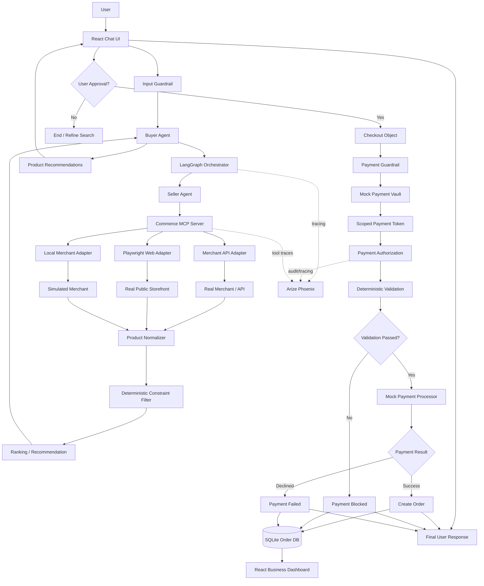

# Agentic Commerce POC — Detailed Design

## 1. Executive Summary

### POC objective

Build a local, management-ready **Agentic Commerce** demonstration in which a user can express a shopping request in natural language and the system can:

1. Understand the user's intent and constraints.
2. Discover products from **real web sources and/or merchant APIs** through a controlled MCP layer.
3. Compare and rank products against the user's requirements.
4. Present recommendations with reasons grounded in retrieved product data.
5. Allow the user to explicitly approve a purchase.
6. Create a **simulated, scoped payment token/authorization** without exposing the underlying card credentials to the agent.
7. Validate the transaction with deterministic guardrails before payment execution.
8. Simulate success and failure cases such as amount mismatch, expired token, wrong merchant, or replay.
9. Record the order and audit trail.
10. Display the completed transaction in a React dashboard.
11. Trace the agent/tool workflow with local Arize Phoenix and optionally LangSmith.

### The central idea

> **The demo is not simply an AI shopping chatbot. It demonstrates trusted, user-authorized agentic commerce.**

The POC should show both sides of the problem:

- **Agentic intelligence:** intent understanding, planning, merchant discovery, recommendation, and orchestration.
- **Trust and control:** user consent, tool permissions, payment tokenization, deterministic validation, guardrails, auditability, and observability.

### Core architecture principle

> **LLMs reason; deterministic services verify and execute.**

The Buyer Agent and Seller Agent can use LLM reasoning. Payment authorization, transaction validation, limits, token expiry, signature verification, and final payment execution should be deterministic code.

---

# 2. What This POC Is Simulating

The real-world agentic-commerce ecosystem is evolving toward interactions among:

- A **consumer / buyer**
- A **buyer-side AI agent**
- One or more **merchant / seller systems or agents**
- A **commerce protocol / standardized interaction layer**
- A **payment authorization layer**
- A **payment processor / bank / card network**
- Order and fulfillment systems
- Fraud, risk, identity, and audit controls

This POC compresses that ecosystem into a locally runnable system while preserving the major architectural concepts.

```text
REAL WORLD CONCEPT                         LOCAL POC
---------------------------------------------------------------
User / shopper                     ->      React chat UI
Buyer AI agent                     ->      Buyer Agent
Merchant / seller                  ->      Seller Agent
Commerce capability interface     ->      MCP Commerce Server
Merchant API / storefront          ->      Merchant adapters
Payment credentials                ->      Mock Payment Vault
Agent payment credential           ->      Scoped mock token
Payment mandate / authorization   ->      Signed local authorization
Payment processor                  ->      Mock Payment Processor
Fraud / policy checks              ->      Deterministic Guardrails
Order management                   ->      SQLite Order DB
AI observability                   ->      Phoenix / optional LangSmith
Business reporting                 ->      React Dashboard
```

The POC should **not claim to be a production implementation of ACP, UCP, AP2, Visa Agentic Tokens, Mastercard Agentic Tokens, Stripe Shared Payment Tokens, or a bank payment rail**. Instead, it should state that it **implements a local reference flow inspired by these concepts**.

---

# 3. Current Ecosystem: How the Pieces Fit Together

## 3.1 ACP — Agentic Commerce Protocol

OpenAI describes ACP as an open standard that acts as connective infrastructure between merchants and shoppers in ChatGPT, including structured catalog and merchant inventory information.

Reference:
- https://developers.openai.com/commerce

## 3.2 UCP — Universal Commerce Protocol

Google's UCP is an open standard for agentic commerce intended to create common commerce capabilities across consumer surfaces, businesses, and payment providers. Google describes UCP as compatible with AP2 and capable of working with APIs, A2A, and MCP. Google also lists Flipkart and major payment/commerce companies among the broader ecosystem.

Reference:
- https://developers.googleblog.com/under-the-hood-universal-commerce-protocol-ucp/

## 3.3 MCP — Model Context Protocol

MCP is the **tool/data access layer** in this architecture. It standardizes how an agent invokes capabilities such as product search, inventory lookup, pricing, checkout, etc.

Important distinction:

> **MCP is not the commerce protocol and is not the payment protocol.**

In this POC, the agent will call MCP tools such as:

```text
search_products()
get_product()
check_inventory()
get_price()
calculate_shipping()
create_checkout()
get_order_status()
```

The MCP implementation can internally call:

- A merchant's official API
- A local merchant service
- A controlled browser automation adapter

## 3.4 AP2 — Agent Payments Protocol

Google's AP2 focuses on securing agent-performed payment transactions. Its specification includes checkout/payment mandates, linked receipts, verification responsibilities, authorization, and cryptographic binding.

Reference:
- https://github.com/google-agentic-commerce/AP2/blob/main/docs/ap2/specification.md

Our local POC will **simulate these ideas** with a signed, scoped authorization object bound to the approved checkout.

## 3.5 Tokenized agent payments

Stripe's agentic-commerce materials describe Shared Payment Tokens (SPTs), where an agent can initiate a payment without receiving the underlying payment credentials and where tokens can be scoped to seller, amount, and time.

Reference:
- https://stripe.com/blog/agentic-commerce-suite

For the POC, we will implement the same high-level security principle:

```text
RAW CARD CREDENTIAL
        |
        | never exposed to agent
        v
PAYMENT VAULT
        |
        | issue constrained token
        v
AGENT PAYMENT TOKEN
```

The POC token is a simulation; it is not a real network token.

---

# 4. Recommended End-to-End Demo

## Example user request

> "I want road-running shoes, size 10, under $100. I prefer something lightweight with good cushioning."

## Expected high-level flow

```text
User
  |
  v
Input Guardrail
  |
  v
Buyer Agent
  |
  v
LangGraph Orchestrator
  |
  v
MCP Commerce Layer
  |
  +-------------------------+
  |            |            |
  v            v            v
Merchant API  Real Web    Local Merchant
              /Playwright
  |            |            |
  +------------+------------+
               |
               v
        Product Normalizer
               |
               v
        Hard Constraint Filter
               |
               v
        Ranking / Recommendation
               |
               v
           User Review
               |
           User Approval
               |
               v
        Checkout Validation
               |
               v
       Payment Guardrail Layer
               |
               v
      Scoped Payment Token
               |
               v
       Payment Authorization
               |
               v
       Mock Payment Processor
             /       \
            /         \
        SUCCESS      DECLINE
           |            |
           +------┬-----+
                  v
              Order DB
               /    \
              /      \
             v        v
       Chat Result   Dashboard
                         |
                         v
                    Audit / Trace
```

---

# 5. Mermaid Architecture Flow

Use the following Mermaid diagram in the README / presentation.



---

# 6. Recommended Multi-Agent Design

Do not create 8–10 agents just for the sake of saying the system is multi-agent. For a 2–3 day POC, use **three meaningful agent roles** plus deterministic services.

## Agent 1 — Buyer Agent

### Responsibility

Represents the shopper's AI assistant.

### Responsibilities

- Understand natural language intent.
- Extract constraints and preferences.
- Decide which commerce tools are needed.
- Coordinate product discovery.
- Compare returned options.
- Explain recommendations.
- Ask for clarification only when essential.
- Never access raw payment credentials.
- Never directly execute payment.

### Example

User:

> "Find running shoes size 10 under $100, lightweight."

Buyer Agent produces structured intent:

```json
{
  "category": "running shoes",
  "size": 10,
  "max_price": 100.00,
  "currency": "USD",
  "preferences": ["lightweight"],
  "use_case": "road running"
}
```

---

# 7. Agent 2 — Seller Agent

### Responsibility

Represents the merchant side of the interaction.

### Responsibilities

- Receive a product search intent.
- Query merchant catalog capabilities.
- Return product information.
- Check inventory.
- Return current price.
- Calculate shipping/tax for the demo.
- Create a checkout object.
- Return an order after payment confirmation.

The Seller Agent should not invent factual product attributes. Product facts must be returned from the merchant data source.

Example tool calls:

```text
search_products(query, filters)
get_product(product_id)
check_inventory(product_id, size)
get_price(product_id, size)
calculate_shipping(cart)
create_checkout(cart)
confirm_order(payment_reference, checkout_id)
```

---

# 8. Agent 3 — Payment Agent

### Responsibility

Represents the payment-side reasoning/coordination role.

However, actual authorization and payment execution are **deterministic**.

### Payment Agent can:

- Request a payment token from the protected payment service.
- Prepare the payment authorization request.
- Explain why a payment is blocked.
- Submit a validated transaction to the mock processor.

### Payment Agent cannot:

- Read the raw card number.
- Read CVV.
- Change the authorized amount.
- Change merchant after user approval.
- Bypass payment guardrails.
- Override a failed validation.

---

# 9. Guardrails — Required, Not Optional

Because the system is allowed to act on a user's behalf, guardrails should be visible in the architecture and demo.

## 9.1 Input guardrail

Purpose:

- Identify whether the request is a valid commerce request.
- Reject unsafe or disallowed requests.
- Prevent requests for raw payment credential disclosure.
- Require enough information to begin shopping.

Examples:

```text
Allowed:
"Find running shoes under $100."

Allowed:
"Compare three laptops for travel."

Blocked / redirected:
"Send the merchant my full card number and CVV."
```

## 9.2 Tool permission guardrail

Each agent should have an explicit tool allowlist.

| Agent | Allowed tools | Blocked tools |
|---|---|---|
| Buyer Agent | search, product details, inventory, price, checkout preparation | raw payment, vault credentials, final payment execution |
| Seller Agent | catalog, inventory, price, checkout, order confirmation | customer payment credentials, unrelated user data |
| Payment Agent | token request, authorization request, transaction submission | raw card access, arbitrary amount changes |
| Guardrail service | validation only | agent reasoning / free-form changes |

This is one of the strongest security demonstrations for management.

## 9.3 Transaction guardrail

Before payment execution:

```text
1. Merchant matches approved merchant
2. Currency matches
3. Amount equals approved total
4. Amount <= token maximum
5. Checkout hash matches
6. Token is valid
7. Token is not expired
8. Token has not already been used
9. Authorization signature is valid
10. User approval exists
```

## 9.4 Output guardrail

The final assistant response must not invent:

- price
- inventory
- payment status
- order ID
- merchant confirmation

Those facts must come from system state.

---

# 10. Website Access — How We Reach Amazon, Flipkart, or Other Real Sites

This is a critical design decision.

## Important concept

**MCP does not itself browse Amazon.**

MCP provides the standardized interface through which the agent calls a capability.

The capability may internally use:

1. An official merchant API.
2. A product/feed API.
3. A browser automation layer such as Playwright.
4. A local merchant adapter.

So the architecture is:

```text
Buyer Agent
     |
     | MCP tool call
     v
search_products()
     |
     v
Commerce MCP Server
     |
     +---- Official API adapter
     |
     +---- Playwright adapter
     |
     +---- Local merchant adapter
```

## 10.1 Preferred approach: official API / merchant integration

This is the preferred production-like path because structured commerce data is much more reliable than HTML scraping.

### Shopify

Shopify's Storefront API can expose products, variants, availability and cart/checkout capabilities. This makes Shopify-based storefronts a strong real integration target for the POC.

References:
- https://shopify.dev/docs/api/storefront/latest/objects/Product
- https://shopify.dev/docs/api/storefront/latest/objects/Cart

### Flipkart

Flipkart provides official Affiliate APIs that can search products by keyword/product ID and retrieve product feed information for registered affiliates. Flipkart also provides Marketplace Seller APIs for registered sellers to work with marketplace data and order processes.

References:
- https://affiliate.flipkart.com/api-docs/af_prod_ref.html
- https://affiliate.flipkart.com/api-docs/af_overview.html
- https://seller.flipkart.com/api-docs/index.html

For this POC, **Flipkart is a potentially good real-product source if the required affiliate/API credentials are available**.

### Amazon

Amazon's current Creators API supports operations such as product search, item retrieval, variations and browse nodes. However, the current requirements include Amazon Associates enrollment and at least 10 qualifying sales in the preceding 30 days for access to the relevant API.

Reference:
- https://affiliate-program.amazon.com/creatorsapi/docs/

Therefore:

> **Do not make Amazon's official API a critical path for a 2–3 day demo unless access is already available.**

---

# 11. Playwright — Real Website Access

When an official API is not available, we can use browser automation for product discovery.

Microsoft provides a **Playwright MCP server**. It allows an MCP client/agent to operate a browser using structured accessibility snapshots rather than image-based screen scraping.

References:
- https://github.com/microsoft/playwright-mcp
- https://github.com/microsoft/playwright/blob/main/docs/src/getting-started-mcp.md

Conceptually:

```text
Buyer Agent
    |
    v
Commerce MCP
    |
    v
Playwright Adapter / Playwright MCP
    |
    v
Public Retail Website
    |
    +--> Search
    +--> Product page
    +--> Price
    +--> Variant / size
    +--> Availability
```

## What Playwright should be used for

For this POC, use browser automation primarily for **discovery**:

- search
- product details
- price
- size availability
- public shipping information

Avoid using it as a dependency for real payment or a real purchase.

## Why not make Amazon scraping the primary path?

Retail pages can change structure, require login, trigger bot controls, or otherwise become unreliable. A 2–3 day POC should not fail because a retailer changes a page.

Therefore, the recommended strategy is:

```text
PRIMARY:
Local/controlled merchant data + one official API

SECONDARY:
One real public storefront through Playwright

OPTIONAL:
Amazon/other retailer integration if access is already available
```

---

# 12. Recommended Real-Web Strategy for the Demo

Use **three merchant sources** to make the architecture visually compelling:

### Merchant A — Real API source

Use a Shopify-based storefront or another accessible merchant API.

### Merchant B — Real web source

Use a public product website with Playwright for discovery.

### Merchant C — Local controlled merchant

A local JSON/SQLite merchant that guarantees reliable data.

Then the agent sees all three through the same logical MCP capability:

```text
search_products()
       |
       +--> Real API
       |
       +--> Real Web / Playwright
       |
       +--> Local Merchant
```

This demonstrates a key enterprise architecture idea:

> **The agent is decoupled from the underlying merchant implementation.**

The agent requests a commerce capability; the adapter handles the merchant-specific integration.

---

# 13. Product Data Normalization

Different merchants return different schemas. Normalize everything before recommendation.

Recommended normalized schema:

```json
{
  "merchant_id": "merchant_b",
  "merchant_name": "Merchant B",
  "product_id": "SKU123",
  "title": "Road Runner X",
  "brand": "ExampleBrand",
  "category": "running shoes",
  "price": 89.99,
  "currency": "USD",
  "size": 10,
  "available": true,
  "weight_grams": 265,
  "cushioning": "high",
  "rating": 4.5,
  "review_count": 1200,
  "shipping_cost": 0,
  "product_url": "https://...",
  "source": "shopify_api"
}
```

The LLM should not be responsible for normalizing key financial facts. Use Pydantic/models and deterministic transformation.

---

# 14. Recommendation Logic

Use a hybrid strategy.

## Step 1 — Hard constraints

Do deterministic filtering first:

```text
size == requested size
price <= user max price
available == true
category matches
```

## Step 2 — Ranking

Calculate a simple deterministic score.

Example:

```text
score =
    budget_fit
  + size_match
  + use_case_match
  + cushioning_match
  + lightweight_match
  + rating_score
  + shipping_score
```

Weights can be simple and documented.

## Step 3 — LLM explanation

The Buyer Agent explains the ranked results:

```text
Recommended:
Road Runner X — $89.99

Why:
- Meets size 10 requirement
- Under the $100 budget
- Lightweight
- High cushioning
- In stock
- Free shipping
```

The explanation is generated by the LLM, but factual attributes come from retrieved data.

---

# 15. Checkout Model

Once the user selects a product, generate a checkout object.

```json
{
  "checkout_id": "chk_10023",
  "merchant_id": "merchant_b",
  "product_id": "SKU123",
  "quantity": 1,
  "size": 10,
  "subtotal": 89.99,
  "shipping": 0.00,
  "tax": 0.00,
  "total": 89.99,
  "currency": "USD"
}
```

Then compute a deterministic checkout hash from canonicalized fields.

Example concept:

```text
checkout_hash = SHA256(canonical_checkout_json)
```

The authorization should bind to this checkout hash.

---

# 16. Tokenized Payment Simulation

## Why the token exists

The Buyer Agent should not receive:

- raw credit card number
- CVV
- real banking credentials

Instead, a local mock vault contains the simulated payment instrument.

```text
Mock Payment Vault
      |
      | issue scoped credential
      v
Payment Token
```

Example token:

```json
{
  "token_id": "tok_demo_7F3K9",
  "merchant_id": "merchant_b",
  "max_amount": 89.99,
  "currency": "USD",
  "checkout_hash": "abc123...",
  "expires_at": "2026-09-28T18:00:00Z",
  "single_use": true,
  "user_id": "demo-user-001"
}
```

This mirrors the **principle** of scoped agent payment credentials without pretending that the POC is a real network-token implementation.

---

# 17. Payment Authorization / AP2-Inspired Flow

The POC can model two linked concepts:

## Checkout authorization

Represents what the user agreed to purchase.

```text
Merchant: Merchant B
Product: Running Shoe X
Amount: $89.99
Currency: USD
Checkout Hash: abc123
```

## Payment authorization

Represents permission to pay for that checkout.

```text
Token: tok_demo_7F3K9
Checkout Hash: abc123
Amount: $89.99
Merchant: Merchant B
User Approved: true
Signature: <signed payload>
```

The POC can cryptographically sign the authorization object and verify it before processing.

This is inspired by the separation between checkout/payment mandates and verification in AP2.

---

# 18. Payment Guardrail — Main Security Demo

## Successful payment

```text
Approved amount      = $89.99
Requested amount     = $89.99
Merchant             = Merchant B
Token                = VALID
Checkout binding     = VALID
Authorization       = VALID

RESULT = PAYMENT SUCCESS
```

## Tampered payment scenario

Simulate a downstream change:

```text
Approved amount      = $89.99
Requested amount     = $129.99
```

Guardrail:

```text
PAYMENT BLOCKED

Reason:
Requested amount exceeds approved amount.
```

No order should be created.

## Additional failure cases

Implement at least two:

### Expired token

```text
Token expired
=> PAYMENT BLOCKED
```

### Wrong merchant

```text
Authorized merchant = Merchant B
Requested merchant  = Merchant C
=> PAYMENT BLOCKED
```

### Replay attempt

```text
single_use token already used
=> PAYMENT BLOCKED
```

### Checkout hash mismatch

```text
Approved checkout hash != current checkout hash
=> PAYMENT BLOCKED
```

These scenarios demonstrate that the system does not blindly trust an agent's request.

---

# 19. Mock Payment Processor

The processor is deliberately simple.

Input:

```json
{
  "transaction_id": "txn_1001",
  "token_id": "tok_demo_7F3K9",
  "merchant_id": "merchant_b",
  "amount": 89.99,
  "currency": "USD"
}
```

The processor can return:

```json
{
  "status": "SUCCESS",
  "transaction_id": "txn_1001",
  "authorization_code": "AUTH123"
}
```

or:

```json
{
  "status": "DECLINED",
  "reason": "AMOUNT_MISMATCH"
}
```

No real money is moved.

---

# 20. Human-in-the-Loop Approval

User approval is one of the most important parts of the demo.

The agent can autonomously:

- understand intent
- search merchants
- compare products
- prepare checkout

But payment should pause for explicit approval in this POC.

LangGraph supports human-in-the-loop patterns using interruptions so a workflow can pause, collect user input, and resume.

Reference:
- https://langchain-ai.github.io/langgraph/how-tos/human_in_the_loop/review-tool-calls/

Recommended flow:

```text
Agent prepares checkout
        |
        v
+---------------------------+
| PURCHASE REQUIRES APPROVAL|
|                           |
| Product       $89.99      |
| Shipping      $0.00       |
| Total         $89.99      |
|                           |
| [Approve Purchase]        |
| [Cancel]                  |
+---------------------------+
```

---

# 21. LangGraph Responsibilities

Use LangGraph to orchestrate the stateful workflow.

Recommended nodes:

```text
START
  |
  v
input_guardrail
  |
  v
extract_intent
  |
  v
buyer_agent
  |
  v
seller_agent
  |
  v
mcp_product_search
  |
  v
normalize_products
  |
  v
deterministic_filter
  |
  v
rank_products
  |
  v
recommend
  |
  v
human_approval
  |
  v
create_checkout
  |
  v
payment_guardrail
  |
  v
payment_authorization
  |
  v
mock_payment_processor
  |
  +------success------> create_order
  |
  +------failure------> payment_failed
  |
  v
END
```

Keep the graph state explicit so that the payment step never relies on untrusted conversational text for financial facts.

---

# 22. MCP Server Design

## Commerce MCP tools

Recommended initial tool set:

```text
search_products
get_product
check_inventory
get_price
calculate_shipping
create_checkout
get_order_status
```

## Optional payment tools

Payment should preferably stay behind a protected backend service rather than being exposed as an unrestricted generic MCP tool.

If needed, MCP can expose narrowly-scoped operations such as:

```text
request_payment_authorization
get_payment_status
```

but the final validation and execution must remain in deterministic application code.

---

# 23. Frontend Design

Use **React + Vite + Tailwind CSS**.

## Screen 1 — Chat

Purpose:

- collect natural-language shopping intent
- show agent progress
- show recommendations
- allow product selection

Example UI:

```text
+--------------------------------------------------+
| Agentic Commerce Assistant                       |
+--------------------------------------------------+
| User:                                             |
| Find running shoes size 10 under $100             |
|                                                  |
| Agent:                                            |
| ✓ Understood requirements                         |
| ✓ Searching 3 merchant sources                   |
| ✓ Found 14 candidate products                    |
| ✓ 5 meet hard constraints                        |
|                                                  |
| Recommended products                             |
|                                                  |
| [ Shoe A ] [ Shoe B ] [ Shoe C ]                |
| $89.99      $94.00      $79.50                  |
| Size 10 ✓   Size 10 ✓   Size 10 ✓               |
|                                                  |
+--------------------------------------------------+
```

## Screen 2 — Checkout / Consent

Show:

- merchant
- product
- variant
- price
- shipping
- total
- masked payment method
- authorization explanation
- explicit approval button

## Screen 3 — Payment Result

For success:

```text
PAYMENT SUCCESSFUL
Order #ORD-1023
Transaction #TXN-9001
Amount $89.99
```

For failure:

```text
PAYMENT BLOCKED
Reason: Authorized amount $89.99 does not match
requested amount $129.99.
```

## Screen 4 — Dashboard

Business-focused metrics:

```text
Total Purchases
Successful Orders
Failed Payments
Total Spend
Average Order Value
```

Recent transactions:

```text
Order       Merchant     Amount    Status
ORD-1023    Merchant B   $89.99    PAID
ORD-1022    Merchant A   $59.99    PAID
ORD-1021    Merchant C   $129.99   BLOCKED
```

Order details should show the audit trail.

---

# 24. Observability — Phoenix / LangSmith

## Recommended choice

For a local, low-cost POC:

> **Use Arize Phoenix locally as the primary observability layer.**

Phoenix is open-source and supports tracing of LLM/agent application execution through OpenTelemetry/OpenInference.

References:
- https://arize.com/docs/phoenix/
- https://arize.com/docs/phoenix/tracing

The local Phoenix UI can be used to show:

```text
User request
  |
  v
Buyer Agent
  |
  v
MCP tool call
  |
  v
search_products
  |
  v
Recommendation
  |
  v
Human approval
  |
  v
Payment validation
  |
  v
Payment
  |
  v
Order creation
```

## LangSmith

LangSmith remains useful if the team wants cloud-based tracing/evaluation and already uses the LangChain ecosystem.

For this POC, do not make LangSmith a hard dependency if the requirement is local/free.

---

# 25. Recommended Technology Stack

| Layer | Tool | Role |
|---|---|---|
| UI | React + Vite | Chat, checkout, dashboard |
| Styling | Tailwind CSS | Fast UI development |
| API backend | FastAPI | Application orchestration/API |
| Agent orchestration | LangGraph | Stateful multi-agent workflow |
| LLM | Gemini API | Intent/reasoning/explanation |
| Local LLM fallback | Ollama | Optional offline fallback |
| Tool protocol | MCP Python SDK | Standardized tool access |
| Real web | Playwright / Playwright MCP | Public storefront discovery |
| Real merchant integration | Shopify Storefront API / other official APIs | Structured commerce data |
| Real product source | Flipkart Affiliate API if credentials exist | Product discovery |
| Optional real product source | Amazon Creators API if already eligible | Product discovery |
| Database | SQLite | Orders, users, transactions, audit |
| Data | JSON / SQLite | Local merchant catalog |
| Validation | Pydantic | Structured data contracts |
| Cryptography | Python `cryptography` | Sign/verify authorization objects |
| Observability | Arize Phoenix local | Agent/tool traces |
| Optional cloud observability | LangSmith | Tracing/evaluation |

---

# 26. Components We Should NOT Add in the MVP

Avoid unnecessary infrastructure:

```text
Kafka
Redis
Neo4j
Vector database
Kubernetes
Multiple microservices
Real payment gateways
Real card data
Complex RAG
Large multi-agent swarms
```

The demo is about **agentic commerce architecture**, not infrastructure complexity.

---

# 27. Project Structure

Recommended structure:

```text
agentic-commerce-poc/
│
├── frontend/
│   ├── src/
│   │   ├── components/
│   │   ├── pages/
│   │   │   ├── Chat.tsx
│   │   │   ├── Checkout.tsx
│   │   │   ├── PaymentResult.tsx
│   │   │   └── Dashboard.tsx
│   │   └── api/
│   │
│   └── package.json
│
├── backend/
│   ├── main.py
│   │
│   ├── graph/
│   │   └── commerce_graph.py
│   │
│   ├── agents/
│   │   ├── buyer_agent.py
│   │   ├── seller_agent.py
│   │   └── payment_agent.py
│   │
│   ├── mcp/
│   │   ├── server.py
│   │   ├── product_tools.py
│   │   ├── checkout_tools.py
│   │   └── order_tools.py
│   │
│   ├── merchants/
│   │   ├── shopify_adapter.py
│   │   ├── playwright_adapter.py
│   │   └── local_adapter.py
│   │
│   ├── payment/
│   │   ├── vault.py
│   │   ├── token_service.py
│   │   ├── authorization.py
│   │   ├── guardrails.py
│   │   └── processor.py
│   │
│   ├── models/
│   │   ├── intent.py
│   │   ├── product.py
│   │   ├── checkout.py
│   │   ├── payment.py
│   │   └── order.py
│   │
│   └── db/
│       └── commerce.db
│
├── data/
│   ├── merchants.json
│   ├── products.json
│   └── mock_wallet.json
│
├── observability/
│   └── phoenix/
│
└── README.md
```

---

# 28. State Model

The LangGraph state should contain structured fields such as:

```json
{
  "session_id": "sess_001",
  "user_intent": {},
  "merchant_candidates": [],
  "products": [],
  "selected_product": {},
  "checkout": {},
  "user_approved": false,
  "payment_token": {},
  "payment_authorization": {},
  "payment_result": {},
  "order": {},
  "guardrail_events": []
}
```

Important rule:

> The payment layer should use structured state and signed data, not re-parse arbitrary chat text to determine how much money to charge.

---

# 29. Database Tables

A simple SQLite DB is enough.

## users

```text
id
name
email
```

## payment_methods

```text
id
user_id
masked_pan
vault_reference
status
```

## payment_tokens

```text
token_id
user_id
merchant_id
max_amount
currency
checkout_hash
expires_at
single_use
used_at
status
```

## orders

```text
order_id
user_id
merchant_id
product_id
amount
currency
status
created_at
transaction_id
```

## transactions

```text
transaction_id
order_id
token_id
authorized_amount
requested_amount
status
failure_reason
created_at
```

## audit_events

```text
event_id
session_id
actor
event_type
message
timestamp
metadata_json
```

---

# 30. Guardrail Policy Examples

Represent policies in code rather than hidden in prompts.

Example:

```python
MAX_PURCHASE_AMOUNT = 500.00
ALLOWED_CURRENCIES = {"USD"}
TOKEN_SINGLE_USE = True
REQUIRE_USER_APPROVAL = True
```

Payment validation pseudocode:

```text
validate(user_approved)
validate(token.signature)
validate(token.expiry)
validate(token.status == ACTIVE)
validate(token.merchant == checkout.merchant)
validate(token.currency == checkout.currency)
validate(checkout.hash == token.checkout_hash)
validate(checkout.total <= token.max_amount)
validate(request.amount == checkout.total)
validate(token.not_used)
```

Any failed condition should produce a structured guardrail event.

---

# 31. Demo Scenarios

Only three scenarios are needed for the management demo.

## Scenario 1 — Successful purchase

User:

> "Find lightweight running shoes, size 10, under $100."

Flow:

```text
Intent extraction
      -> merchant discovery
      -> MCP calls
      -> products normalized
      -> constraints filtered
      -> recommendations
      -> user selects Shoe A
      -> checkout created
      -> user approves
      -> token issued
      -> authorization validated
      -> payment success
      -> order created
      -> dashboard updated
```

## Scenario 2 — Amount manipulation

Normal approved checkout:

```text
$89.99
```

Simulate modified payment request:

```text
$129.99
```

Expected:

```text
Guardrail detects mismatch
      -> payment blocked
      -> no order
      -> dashboard records blocked transaction
```

## Scenario 3 — Credential-protection guardrail

User asks:

> "Give the merchant my full card number."

Expected:

```text
Input / policy guardrail
      -> request blocked
      -> explain that payment credentials are protected
      -> offer secure authorized-payment flow
```

---

# 32. Management Demo Narrative

The presentation should focus on business behavior rather than code.

### Step 1 — Intent

> "The user does not need to navigate several merchant sites. They simply express what they want in natural language."

### Step 2 — Discovery

> "The Buyer Agent converts that request into structured constraints and interacts with merchant capabilities through MCP."

### Step 3 — Recommendation

> "We retrieve factual product information from merchant sources, filter hard constraints deterministically, and use the agent to explain the relevant trade-offs."

### Step 4 — Consent

> "The agent prepares the checkout, but the user explicitly approves the transaction."

### Step 5 — Trusted payment

> "The agent does not receive the underlying card credential. Instead, a scoped payment authorization is generated for the approved checkout."

### Step 6 — Validation

> "Before payment execution, a deterministic guardrail validates merchant, amount, currency, checkout binding, token validity, expiry, and authorization."

### Step 7 — Failure

> "If the requested amount changes after authorization, the system blocks the payment rather than trusting the agent."

### Step 8 — Auditability

> "The customer sees the business transaction in the dashboard, while engineering can trace the agent and tool sequence through observability."

---

# 33. Management-Level Architecture Story

Use this as the central architecture message:

```text
                 TRUSTED AGENTIC COMMERCE

User Intent
    |
    v
Buyer Agent
    |
    v
Commerce / MCP Layer
    |
    +---- Merchant APIs
    +---- Real Web / Playwright
    +---- Local Merchant
    |
    v
Recommendation
    |
    v
User Consent
    |
    v
Payment Authorization
    |
    v
Tokenized / Scoped Credential
    |
    v
Deterministic Guardrails
    |
    v
Payment Execution
    |
    v
Order + Audit + Dashboard
```

The business point is:

> **Autonomous commerce requires both intelligence and trust.**

---

# 34. Implementation Plan

## STAGE 1 : Agentic Discovery

### Goal

Complete the shopping experience before payment.

### Build

1. React chat UI.
2. FastAPI backend.
3. LangGraph workflow.
4. Buyer Agent.
5. Seller Agent.
6. MCP Commerce Server.
7. Local merchant data.
8. One real merchant/API adapter.
9. Optional Playwright adapter.
10. Product normalizer.
11. Deterministic filtering/ranking.
12. Recommendation cards.

### milestone

This must work:

```text
User request
 -> Buyer Agent
 -> MCP
 -> at least 2–3 merchant sources
 -> product comparison
 -> recommendation
```

Do not add payment until this works.

---

# 35. Stage 2 : Checkout + Secure Payment Simulation

### Goal

Complete a full purchase lifecycle.

### Build

1. Product selection.
2. Checkout object.
3. User approval interrupt.
4. Mock payment vault.
5. Scoped token generation.
6. Authorization object.
7. Checkout hash.
8. Signature generation/verification.
9. Payment guardrail.
10. Mock payment processor.
11. Success flow.
12. Failure flow.

### milestone

```text
select
 -> approve
 -> token
 -> validate
 -> pay
 -> order
```

and:

```text
approved $89.99
requested $129.99
 -> BLOCKED
```

must work.

---

# 36. Stage 3: Dashboard + Observability + Demo Polish

### Goal

Make the system management-ready.

### Build

1. React purchase dashboard.
2. Transaction history.
3. Success/failure metrics.
4. Guardrail events.
5. Audit trail.
6. Phoenix tracing.
7. Loading/progress states.
8. Better recommendation cards.
9. Better payment authorization view.
10. Demo reset button.
11. Prepared demo scenarios.

### Final milestone

The following should be demonstrable from one laptop without external infrastructure:

```text
Chat -> Search -> Recommend -> Select -> Approve -> Pay -> Dashboard
```

plus:

```text
Tamper -> Guardrail -> Block -> Audit
```

---

# 37. Recommended Build Order Inside the Codebase

Do not build everything simultaneously.

```text
1. Local merchant search
2. MCP server
3. LangGraph buyer flow
4. React chat
5. Recommendation UI
6. Real API adapter
7. Playwright adapter
8. Checkout
9. Mock payment vault
10. Token / authorization
11. Guardrails
12. Mock processor
13. SQLite orders
14. Dashboard
15. Phoenix tracing
16. Final demo polish
```

This sequence minimizes risk because each step produces a working vertical slice.

---

# 38. Real Website Integration Strategy — Final Recommendation

For this particular POC, use the following order of preference:

## Tier 1 — Controlled and reliable

**Local merchant service**

Purpose:
- always available
- predictable schema
- predictable inventory
- predictable failure scenarios

## Tier 2 — Real structured commerce source

**Shopify Storefront API or Flipkart API if credentials are available**

Purpose:
- demonstrates real merchant integration
- structured data
- less brittle than page scraping

## Tier 3 — Real web browsing

**Playwright / Playwright MCP**

Purpose:
- demonstrates that an agent can interact with a real public storefront
- useful for discovery
- impressive visually in a demo

## Tier 4 — Amazon

Use the official Amazon API if existing eligibility/access is already available; otherwise do not spend the 2–3 day build window trying to obtain it.

---

# 39. What “Real-World Mimic” Means Here

The POC is considered a good real-world simulation when the following relationships are preserved:

### Identity / intent

```text
User
 -> Buyer Agent
```

### Commerce

```text
Buyer Agent
 <-> Merchant Capability Layer
```

### Tool access

```text
Agent
 -> MCP
 -> Merchant Tool
```

### Consent

```text
User
 -> explicit approval
```

### Payment authorization

```text
Approved Checkout
 -> Scoped Payment Authorization
```

### Credential protection

```text
Underlying credential
 -> never exposed to agent
```

### Transaction integrity

```text
Authorized checkout
 <-> payment request
```

### Execution

```text
Validated transaction
 -> payment processor
```

### Auditability

```text
Agent + tools + payment + order
 -> trace + audit record
```

The POC does not need a real bank transaction to demonstrate these concepts.

---

# 40. What We Should Say vs. What We Should Not Say

## Say

- "MCP-based merchant capability access"
- "Multi-agent commerce workflow"
- "AP2-inspired payment authorization"
- "Simulated scoped payment token"
- "Deterministic payment guardrails"
- "Human-in-the-loop purchase approval"
- "Real merchant/API discovery where available"
- "Real public web discovery through Playwright"
- "Local mock payment processor"

## Do not say

- "We implemented Visa Agentic Tokens"
- "We implemented Mastercard Agentic Tokens"
- "We implemented real AP2 production payments"
- "We securely processed real credit cards"
- "The agent has access to the user's card"
- "This is a live bank integration"

The distinction is important for technical and executive credibility.

---

# 41. Risks and Mitigations

| Risk | Mitigation |
|---|---|
| Retail site changes | Keep local merchant as guaranteed fallback |
| Amazon API unavailable | Do not make Amazon critical path |
| Bot detection | Use official APIs where possible; use Playwright only for discovery |
| LLM hallucination | Ground factual fields in structured tool results |
| Agent overreach | Strict tool allowlists |
| Payment manipulation | Deterministic amount/merchant/hash/token checks |
| Credential leakage | Agent never sees raw credentials |
| LLM provider quota | Keep prompts small; use local fallback if needed |
| Demo instability | Pre-seeded merchant data and deterministic test scenarios |
| Observability dependency | Run Phoenix locally |

---

# 42. Final Target State

The completed POC should feel like this:

```text
                         USER
                           |
                           v
                 +-------------------+
                 |   REACT CHAT UI   |
                 +---------+---------+
                           |
                           v
                 +-------------------+
                 |  INPUT GUARDRAIL  |
                 +---------+---------+
                           |
                           v
                 +-------------------+
                 |    BUYER AGENT    |
                 +---------+---------+
                           |
                           v
                 +-------------------+
                 |     LANGGRAPH     |
                 +---------+---------+
                           |
                 +---------+----------+
                 |                    |
                 v                    v
        +----------------+   +----------------+
        |  SELLER AGENT  |   |   MCP LAYER    |
        +-------+--------+   +-------+--------+
                |                    |
                +---------+----------+
                          |
                          v
                +--------------------+
                | MERCHANT SOURCES   |
                |                    |
                | API / Web / Local  |
                +---------+----------+
                          |
                          v
                +--------------------+
                | PRODUCT NORMALIZER |
                +---------+----------+
                          |
                          v
                +--------------------+
                | FILTER + RANK      |
                +---------+----------+
                          |
                          v
                +--------------------+
                | RECOMMENDATIONS    |
                +---------+----------+
                          |
                          v
                       APPROVE
                          |
                          v
                +--------------------+
                | CHECKOUT + CONSENT |
                +---------+----------+
                          |
                          v
                +--------------------+
                | PAYMENT GUARDRAIL  |
                +---------+----------+
                          |
                          v
                +--------------------+
                | SCOPED MOCK TOKEN  |
                +---------+----------+
                          |
                          v
                +--------------------+
                | PAYMENT AGENT      |
                +---------+----------+
                          |
                          v
                +--------------------+
                | VALIDATION SERVICE |
                +---------+----------+
                          |
                          v
                +--------------------+
                | MOCK PAYMENT PSP   |
                +---------+----------+
                          |
                     +----+----+
                     |         |
                     v         v
                  SUCCESS    BLOCKED
                     |         |
                     +----+----+
                          |
                          v
                +--------------------+
                |   SQLITE ORDERS    |
                +---------+----------+
                          |
              +-----------+-----------+
              |                       |
              v                       v
     +----------------+      +------------------+
     | REACT DASHBOARD|      | PHOENIX TRACING  |
     +----------------+      +------------------+
```

---

# 43. One-Sentence Architecture Summary

> **A multi-agent, LangGraph-orchestrated commerce assistant uses MCP to interact with real and simulated merchant capabilities, uses deterministic ranking and guardrails to control agent behavior, requires explicit user approval before payment, uses a scoped simulated payment token bound to the approved checkout, validates the transaction independently before execution, and records every outcome in an auditable dashboard and trace.**

---

# 44. Key Takeaway for the POC Team

Do not optimize for the largest number of technologies.

Optimize for one **complete, believable agentic-commerce journey**:

```text
Natural-language intent
        ->
Real / simulated merchant discovery
        ->
Agent recommendation
        ->
User choice
        ->
Checkout
        ->
Explicit approval
        ->
Scoped payment authorization
        ->
Deterministic guardrails
        ->
Mock payment
        ->
Success / failure
        ->
Order
        ->
Dashboard + trace
```

That is enough to demonstrate the core idea of **trusted agentic commerce** while remaining realistic to implement locally within 2–3 days.

---

# 45. References

1. OpenAI — Agentic Commerce Protocol  
   https://developers.openai.com/commerce

2. Google — Universal Commerce Protocol (UCP)  
   https://developers.googleblog.com/under-the-hood-universal-commerce-protocol-ucp/

3. Google Agentic Commerce — AP2 Specification  
   https://github.com/google-agentic-commerce/AP2/blob/main/docs/ap2/specification.md

4. Shopify — Storefront API Product  
   https://shopify.dev/docs/api/storefront/latest/objects/Product

5. Shopify — Storefront API Cart  
   https://shopify.dev/docs/api/storefront/latest/objects/Cart

6. Amazon — Creators API Documentation  
   https://affiliate-program.amazon.com/creatorsapi/docs/

7. Flipkart — Affiliate Product API Documentation  
   https://affiliate.flipkart.com/api-docs/af_prod_ref.html

8. Flipkart — Affiliate API Overview  
   https://affiliate.flipkart.com/api-docs/af_overview.html

9. Flipkart — Marketplace Seller API Documentation  
   https://seller.flipkart.com/api-docs/index.html

10. Microsoft — Playwright MCP  
    https://github.com/microsoft/playwright-mcp

11. Microsoft — Playwright MCP Getting Started  
    https://github.com/microsoft/playwright/blob/main/docs/src/getting-started-mcp.md

12. Stripe — Agentic Commerce Suite / Shared Payment Tokens  
    https://stripe.com/blog/agentic-commerce-suite

13. Arize — Phoenix  
    https://arize.com/docs/phoenix/

14. Arize — Phoenix Tracing  
    https://arize.com/docs/phoenix/tracing

15. LangGraph — Human-in-the-loop / Review Tool Calls  
    https://langchain-ai.github.io/langgraph/how-tos/human_in_the_loop/review-tool-calls/

---

## Final Recommendation

### Build this exact MVP:

**React + FastAPI + LangGraph + 3 logical agents (Buyer, Seller, Payment) + MCP Commerce Server + one real structured merchant API + one real public website via Playwright + one local merchant + SQLite + cryptographic mock payment token + deterministic guardrails + mock payment processor + React dashboard + local Phoenix tracing.**

Keep the payment execution deterministic, keep raw payment credentials outside the agent, require human approval in the POC, and demonstrate both a successful purchase and a blocked/tampered payment.
