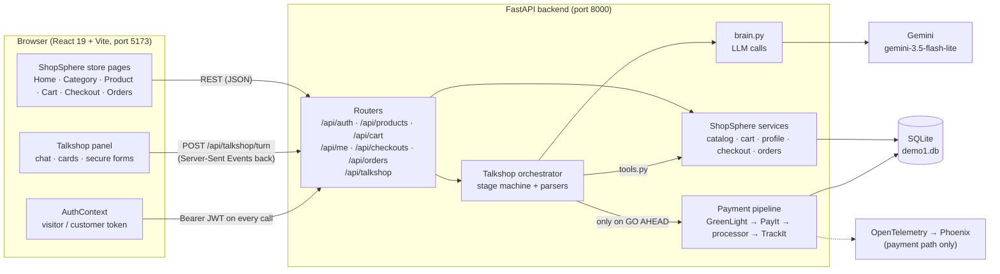
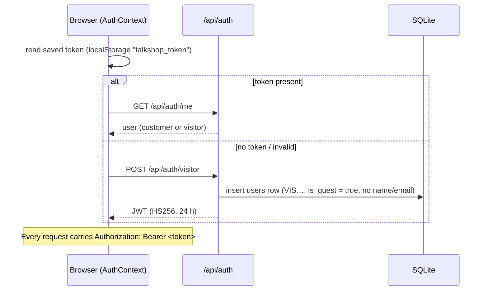
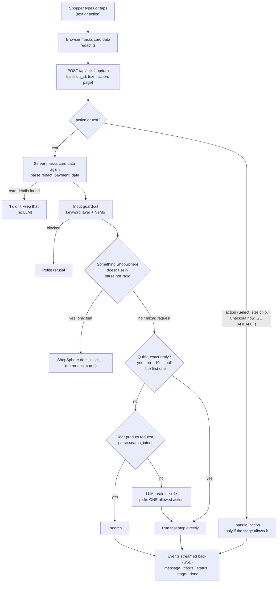
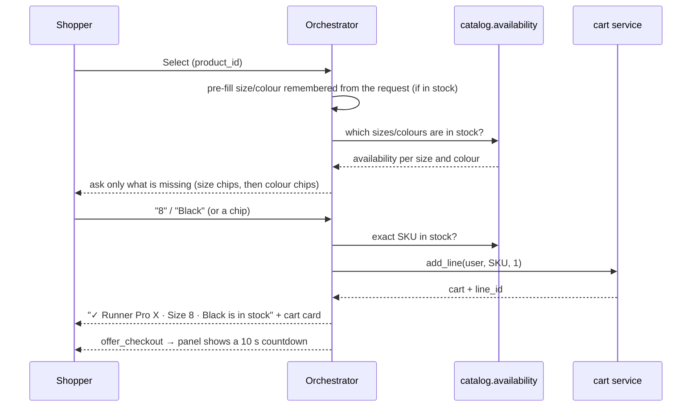
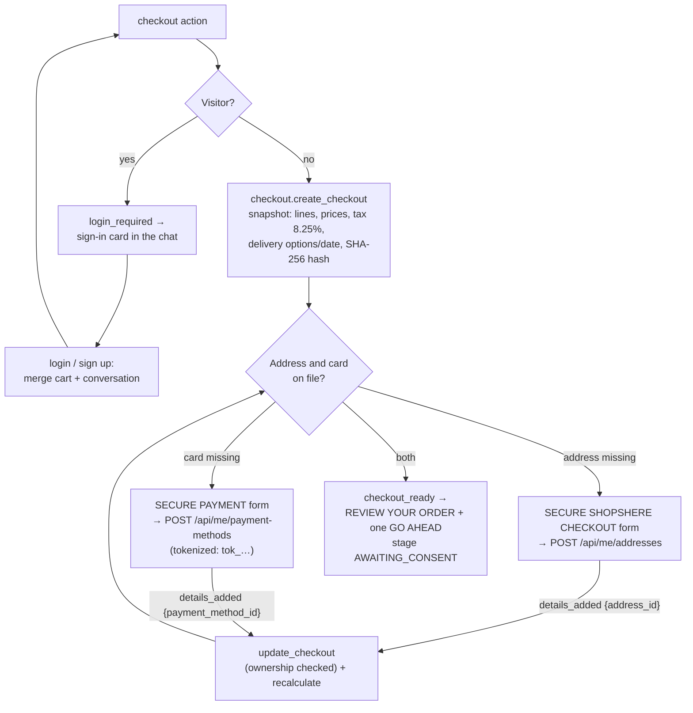
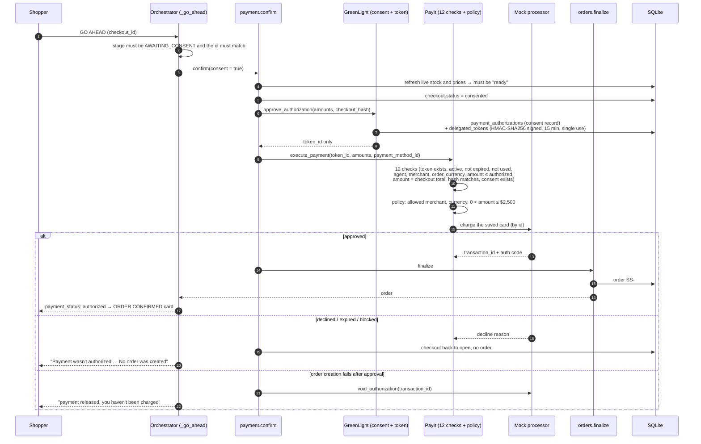
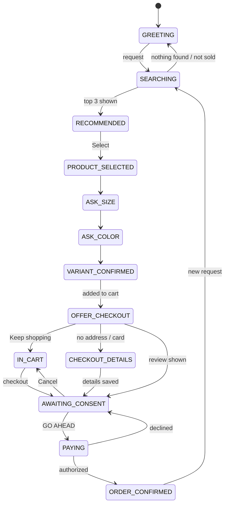

# ShopSphere + Talkshop: System Workflow

This document follows one purchase through the whole Demo 1 system, from the moment the store opens to the order confirmation. It also covers what happens in the backend at each step, and the safety checks along the way.

- **ShopSphere** is the merchant website: its catalog, cart, checkout and orders.
- **Talkshop** is ShopSphere's AI shopping assistant. It lives in the panel on the right of every page.

> The diagrams use Mermaid. They render on GitHub, and in VS Code's Markdown preview with a Mermaid extension.

---

## 1. The big picture



### Who is responsible for what

| Layer | Owns | Never does |
|---|---|---|
| **Talkshop (LLM)** | Understanding what the shopper means, holding the conversation, choosing the next allowed step, writing short product reasons | Set prices, stock, tax or totals; see card numbers or addresses; start a payment |
| **ShopSphere (merchant backend)** | Catalog, inventory, cart, customer profile and addresses, pricing, tax (8.25%), delivery, checkout, orders | Make decisions from free text |
| **Payment pipeline** | Consent record, single-use payment token, the 12 security checks, charging the saved card, order creation | Run without an explicit GO AHEAD |

The LLM only ever **chooses** an action. The code checks that the action is allowed at this stage of the conversation, and the merchant services produce every number the shopper sees.

---

## 2. Step 0: the store opens (identity)

Anyone can browse, fill a cart and chat. An account is needed only to check out.



**Technical details**
- **Tokens:** a JWT signed with HS256 that lasts 24 hours. `get_current_user` decodes it on every request.
- **Visitors** are real `users` rows with `is_guest = true`.
  - **Open to them:** browsing, the cart and Talkshop.
  - **Guest checkout:** they can **check out as a guest**. That checkout keeps a guest email and never becomes a customer account (see section 15).
  - **Customers only:** saved addresses and cards, My Orders, the wallet and loyalty points (`require_customer` → 403 `LOGIN_REQUIRED`).
- **Logging in or signing up as a visitor** sends the visitor's token along. The server then:
  - merges the visitor's cart into the account (`merge_carts`: the same SKU adds up, capped by stock);
  - moves the Talkshop conversation across (`talkshop_state.rekey`);
  - deletes the visitor record.
- **Tab sync:** all tabs share one saved login. A `storage` listener reloads the other tabs when the login changes, and a request with no token reloads the page so it can recover.

---

## 3. Step 1: one chat turn, end to end

Every message or button tap in the panel is **one turn**: `POST /api/talkshop/turn`. The answer streams back as a series of **Server-Sent Events**, which draw the bubbles, cards and status lines one at a time.



**Technical details**
- **Session state** is in memory, keyed by `(user_id, session_id)` (`talkshop/state.py`). It holds:
  - the stage and the product currently selected;
  - the size and colour wanted;
  - the cart lines Talkshop added;
  - the checkout id;
  - a transcript of every event sent.
- **Reloads:** after a page reload the panel rebuilds itself from the transcript (`GET /api/talkshop/sessions/{id}`).
- **Quick paths before the LLM:** short, unambiguous replies are matched exactly against the options ShopSphere offers. This keeps them fast, and they never depend on the model. Anything richer goes to the LLM.
- **Message names a product:** a message that names a product ("…can I get nike shoes in size 10") is never taken as a quick answer to the question on screen.
- **LLM calls** have a 10 s timeout and one retry. Each has a deterministic fallback, so a model hiccup never stalls the chat.
- **Status lines** name the step that is working: `VibeCheck` understands the request, `SneakPeek` searches, `CartUp` handles the cart, and `GreenLight`, `PayIt` and `TrackIt` handle payment.

---

## 4. Step 2: search and recommendations

```mermaid
sequenceDiagram
    participant O as Orchestrator (_search)
    participant C as catalog.search
    participant L as LLM (brain.recommend)
    participant P as Panel

    O->>C: filters (category, brand, max_price, gender, colour) + query words
    C-->>O: top 3 in-stock products (relevance, then rating)
    Note over O: relax one filter at a time if empty<br/>(colour, then budget); say which
    O->>L: request + product facts (name, tags, colours, sizes, category)
    L-->>O: intro, one reason per product,<br/>wants {size, colour}, fits true/false
    alt fits = false (none is what was asked for)
        O-->>P: "ShopSphere doesn't sell …" (no cards)
    else
        O->>O: remember wants (e.g. size 10, Teal)
        O-->>P: recommendations event (cards shown in the wanted colour)
    end
```

**Technical details**
- **Facts:** the LLM writes only the intro and the short reasons. Prices, ratings and stock always come from the catalog.
- **What you asked for:** the same LLM call reads typos and shades as a person would ("tale" means Teal, "sea green" means Teal). Code accepts only colours the products really come in.
- **Relevance:** in that call the LLM also judges whether the results are the kind of thing you asked for. Only an explicit "doesn't fit" hides the cards.
- **Not sold:** a fixed list of things ShopSphere doesn't sell (groceries, furniture, pet supplies, books, toys, beauty, appliances, medicine, vehicles) is caught before any search. "no"/"not" rules out only the next item.

---

## 5. Step 3: choose size and colour, add to cart



**Technical details**
- **Sold out:** sold-out sizes and colours are shown crossed out and can't be chosen. A single in-stock option is picked automatically.
- **Cart lines:** Talkshop records which cart lines it added (`line_ids`, `added_qty`). Checkout from the chat then covers only those, even if the cart holds other items.
- **Countdown:** after 3 seconds the panel sends the `checkout` action by itself.
  - It pauses if the shopper clicks into the chat box.
  - It never runs while the panel is minimised, or for a conversation restored after a reload.
  - Moving to checkout never pays.

---

## 6. Step 4: checkout (login, missing details, review)



**Technical details**
- **The checkout snapshot is authoritative.** It records the lines, unit prices, subtotal, tax, shipping, total, delivery date and a **SHA-256 `checkout_hash`** over all of them. These amounts are what get charged. The browser never sends a price.
- **Secure forms are ShopSphere's, not the chat's.**
  - The address goes straight to the profile API, which checks the required fields, a 2-letter state code and the ZIP format.
  - The card goes straight to the card endpoint, which checks the Luhn checksum, the expiry and the CVC. It stores only the brand, the last 4 digits, the expiry and a vault token.
  - Talkshop receives **only the id**, and the LLM never sees the details.
- **Ownership:** an address or card id that isn't the customer's own is refused (`UNKNOWN_ADDRESS` / `UNKNOWN_CARD`).
- **On the Review card** the shopper can change the quantity, delivery (standard free, express $9.99), address or card. Each change goes through `update_checkout`, which recalculates everything and the hash.

---

## 7. Step 5: GO AHEAD → payment → order

Payment starts only from the GO AHEAD action (`{type: "go_ahead", checkout_id}`):
- **Tapped:** the shopper presses GO AHEAD.
- **Automatic:** the Review card's 3-second countdown runs out without **Stop** being pressed (`consent: "auto_countdown"`).
  - At most once per checkout, and never retried after a decline.
  - Touching the card or the chat box stops it.

The audit log records which of the two it was (`CHECKOUT_CONSENT`). Typed text such as "pay now" never pays, and the LLM's list of actions doesn't include payment.



**Technical details**
- **The token is scoped.** It is bound to this checkout, merchant, amount, currency and checkout hash. It expires after 15 minutes and is consumed on use. Any change to the order after consent breaks the hash check.
- **Tracing:** the payment path (PayIt, the guardrail engine, the processor and TrackIt) is traced with OpenTelemetry and exported to Phoenix when it's running. Spans record ids and outcomes, never card data.
- **Audit:** consent and payment events are written to `audit_events`.

---

## 8. Conversation stages

The orchestrator only allows actions that make sense at the current stage (`state.ALLOWED`), so the LLM can't skip ahead.



| Stage | Allowed next |
|---|---|
| GREETING | search, answer, select |
| RECOMMENDED | select, search, answer |
| PRODUCT_SELECTED / ASK_SIZE / ASK_COLOR | choose option, search, answer, select |
| IN_CART / OFFER_CHECKOUT | checkout, keep shopping, search, answer, select |
| CHECKOUT_DETAILS | cancel, answer, search (GO AHEAD impossible) |
| AWAITING_CONSENT | update checkout, cancel, answer, search; **GO AHEAD button only** |
| PAYING | nothing |
| ORDER_CONFIRMED | search, answer, select |

---

## 9. Events streamed to the panel (SSE)

| Event | Draws |
|---|---|
| `user_message` | The shopper's bubble (already masked) |
| `message` | Talkshop's bubble |
| `status` | "VibeCheck · Understanding your request…" line + presenter trace |
| `stage` / `done` | The progress stepper (Search → Choose → Size → Colour → Cart → Review → Done) |
| `suggestions` | Greeting chips |
| `recommendations` | Top 3 product cards (+ "Talkshop picks" on the store page) |
| `product_selected` | Selected-product card |
| `ask_option` | Size or colour chips (sold out = crossed out) |
| `variant_confirmed` | (internal) the exact SKU |
| `cart_updated` | "Added to your ShopSphere cart" card; header cart badge refreshes |
| `offer_checkout` | 3-second countdown card (Checkout now / Keep shopping) |
| `login_required` | Sign-in card (visitors) |
| `checkout_details_needed` | Secure ShopSphere Checkout / Secure Payment form |
| `checkout_ready` / `checkout_updated` | Review Your Order card with GO AHEAD |
| `payment_status` | Processing → authorizing → authorized / declined / failed |
| `order_confirmed` | Order confirmed card (SS-#####, delivery date, total) |

---

## 10. Key API endpoints

| Area | Endpoints |
|---|---|
| Identity | `POST /api/auth/visitor` · `POST /api/auth/register` · `POST /api/auth/login` · `GET /api/auth/me` · `POST /api/auth/reset-password` |
| Catalog | `GET /api/products` · `GET /api/products/{id}` · `GET /api/products/{id}/availability` |
| Cart | `GET/POST /api/cart/lines` · `PATCH/DELETE /api/cart/lines/{line_id}` |
| Profile | `GET/POST /api/me/addresses` · `DELETE /api/me/addresses/{id}` · `GET/POST /api/me/payment-methods` · `DELETE /api/me/payment-methods/{id}` |
| Checkout | `POST /api/checkouts` · `GET/PATCH /api/checkouts/{id}` · `POST /api/checkouts/{id}/cancel` · `POST /api/checkouts/{id}/confirm` |
| Orders | `GET /api/orders` · `GET /api/orders/{id}` |
| Talkshop | `POST /api/talkshop/turn` (SSE) · `GET/DELETE /api/talkshop/sessions/{id}` |

The website's own checkout page uses the same Checkout and Profile endpoints as Talkshop. **Place order** on the website calls `/confirm` with `consent: true`, which is the same payment pipeline as GO AHEAD.

---

## 11. Data (SQLite tables)

| Group | Tables |
|---|---|
| People | `users` (customers + visitors), `addresses`, `payment_methods` (brand, last 4, expiry, vault token, never the number/CVC) |
| Catalog | `merchants`, `products`, `product_variants` (SKU, size, colour, stock, image) |
| Shopping | `cart_items`, `checkouts` (authoritative snapshot + hash) |
| Orders | `orders` (SS-#####, address + card snapshots), `order_lines` |
| Payment | `payment_authorizations` (consent), `delegated_tokens` (single-use), `audit_events` |
| Other | `wallets`, `loyalty_points`, `loyalty_transactions`, `chat_sessions`, `chat_messages`, `agents` |

Demo data: about 60 products, plus the demo customer Kaajal (`kaajal@shopsphere.demo` / `demo1234`) with two saved addresses and two cards: a Visa •••• 4821 that is approved, and a Mastercard •••• 0019 that is always declined. Reset it with `python -m backend.db.reset_demo --yes` (backend stopped).

---

## 12. Safety checks, in one place

| Where | Check |
|---|---|
| Identity | JWT on every call; visitors check out only as guests (no account created); saved details, My Orders, wallet and points are customer-only |
| Conversation | Stage machine (`ALLOWED`); LLM output is only a choice from allowed actions; payment isn't one of them |
| Chat input | Card numbers, CVC and expiry masked in the browser **and** the server, before display, storage, guardrails or the LLM. Keyword + NeMo input guardrail. Addresses typed during checkout are withheld |
| Recommendations | Not-sold blocker; LLM relevance check; facts only from the catalog |
| Profile | Secure forms post straight to ShopSphere; server-side validation; ownership checks on every id; tokenized cards |
| Checkout | Authoritative snapshot; live stock/price refresh before paying; SHA-256 tamper hash |
| Payment | Explicit GO AHEAD; consent record; signed single-use 15-minute token; 12 checks; $2,500 policy limit |
| After payment | Order only if authorized; guarded stock decrement; void the authorization if the order can't be created |

---

## 13. Failure paths (what the shopper sees)

| Situation | Result |
|---|---|
| Card declined (e.g. Mastercard •••• 0019) | "Payment wasn't authorized … No order was created". Change card, GO AHEAD again |
| Invalid card / expired / bad CVC | Error in the Secure Payment form, nothing saved |
| Bad ZIP or state | Error in the address form |
| Item sold out in that size/colour | Crossed out; Talkshop lists what's in stock |
| Asked for something not sold | "ShopSphere doesn't sell …", no product cards |
| Brand not carried (e.g. Gucci) | "ShopSphere doesn't carry Gucci, but here are similar options" |
| Typed "go ahead" / "pay now" | Nothing charged; points to the GO AHEAD button |
| Card typed into the chat | Masked; "For your security I didn't keep that" |
| Visitor tries to check out | Sign-in card; cart and chat carry over |
| Order creation fails after approval | Payment voided; "you haven't been charged" |
| LLM slow or unavailable | Deterministic fallback: plain wording, quick paths and the blocker list still work |

---

## 14. Where the code lives

| Piece | Files |
|---|---|
| Talkshop orchestrator, stages | `backend/talkshop/orchestrator.py`, `backend/talkshop/state.py` |
| Quick replies, blockers, masking | `backend/talkshop/parse.py` |
| LLM calls | `backend/talkshop/brain.py` (decide, recommend, describe_image) |
| Merchant tools used by Talkshop | `backend/talkshop/tools.py` |
| ShopSphere services | `backend/shop/catalog.py`, `cart.py`, `profile.py`, `checkout.py`, `payment.py`, `orders.py` |
| Payment pipeline | `backend/routers/authorizations.py`, `backend/agents/greenlight.py`, `backend/agents/payit.py`, `backend/payment/guardrail_engine.py`, `policy.py`, `mock_processor.py`, `signing.py` |
| Identity | `backend/auth/*`, `backend/routers/auth.py`, `frontend/src/auth/AuthContext.tsx` |
| Panel | `frontend/src/components/talkshop/TalkshopPanel.tsx`, `cards.tsx`, `frontend/src/talkshop/*` |
| Store pages | `frontend/src/pages/store/*`, `frontend/src/components/shopsphere/*` |
| Plan and decisions | `docs/demo-1-shopsphere-talkshop-plan.md` |

---

## 15. Added later (Phases 10–12 and follow-ups)

| Feature | How it works |
|---|---|
| **Guest checkout** | Log in / Sign up / **Continue as guest**. `POST /api/checkouts` with `guest: true`; `POST /api/checkouts/{id}/guest-details` (name, email, address). The card is tokenized for that one order only. The order stores `guest_email` and never links to a customer account |
| **Saved-card choice and wallet** | New cards are saved only when **Save this card for next time** is ticked. Customers can pay from the **ShopSphere Wallet** (`pay_with: wallet`, balance-checked) |
| **Confirmation email** | Written to the `email_outbox` table after the order exists. Real addresses are sent in the background over **Gmail SMTP** (`.env` `SMTP_*`, App Password, TLS); made-up addresses stay in the outbox. Status: `sent` / `failed` / `outbox`. An email problem never undoes an order |
| **Shipping and tracking** | Simulated carrier (`shipping.py`). Steps: confirmed → payment completed → processing → packed → shipped (`TRK######`) → out for delivery → delivered |
| **Track order** | Header button. Logged-in customers see their own orders. Guests use **Order ID + email** (`POST /api/orders/track`); any mismatch gets one neutral error |
| **Tracking in Talkshop** | "Where is my order?" / "I placed an order of nike shoes". Logged in: matched against the customer's own orders. Guest: a secure lookup card (Order ID + email). Answered by code, never the AI |
| **Automatic payment** | The Review card places the order after **3 s** unless **Stop** is pressed. Consent is recorded as `auto_countdown` |
| **Loyalty points** | Customers only: 1 point per $1. **100 points = $1 off** the products before tax, with at least $1 payable. Points are spent only when the payment is authorized. Shown in the account menu, at checkout, on the confirmation and in the email; Talkshop answers "how many points do I have?" |
| **"We don't sell that"** | A list of product types ShopSphere doesn't sell, plus an AI relevance check. No unrelated cards are shown |
| **Live guardrail trace** | Every guardrail decision streams as a `guardrail` event (agent, check, pass/blocked/info, protocol). It's shown in Talkshop's info view (ⓘ) along with the Guardrails, Protocols and Email tabs. No card data or emails appear in the trace |

### Protocol mapping (inspired by, not certified)

| Step | Protocol |
|---|---|
| The AI picks a tool from a fixed list | **MCP** |
| Product discovery, identity (log in / guest), order tracking | **UCP** |
| Merchant-owned checkout: create / update / complete; card → token | **ACP** |
| Consent record, signed single-use token, 12 checks, audit log | **AP2** |
| Agents from different companies talking | **A2A**: not implemented (the agents hand off inside one app) |
