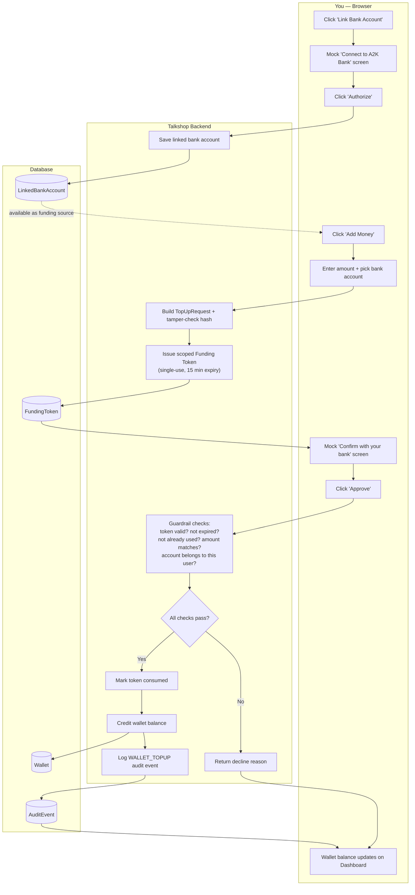

# Wallet Top-Up Flow (Proposed — not yet implemented)

Design note for adding a real "Add Money to Wallet" feature to Talkshop, modeled after Stripe's Shared Payment Token / Agentic Commerce Protocol pattern — the same trust model the existing DPAT purchase flow (GreenLight → PayIt) already uses. This document is the flow only; nothing described here has been built yet.

## Why this shape

The current wallet starts at a fixed balance with no way to add funds. In the real world, stored-value wallets (PayPal balance, Amazon Pay, Cash App) work by linking a funding source once, then issuing a scoped, single-use, amount-capped token each time you load money — the app never touches your actual bank credentials. Talkshop's DPAT token already does exactly this for *purchases*; this flow reuses the same pattern one step earlier, for *funding the wallet in the first place*.

## Flow diagram

## Step-by-step

1. **Link a bank account (one-time setup)** — Dashboard gets a "Link Bank Account" option. Clicking it shows a mock "Connect to A2K Bank" screen (simulating the real-world Plaid-style login-and-consent flow). Backend saves a `LinkedBankAccount` record — bank name, masked account number ("•••• 1234"), tied to the user. Done once; after that it's available as a funding source, the same way the mock Visa •••• 4242 card already is for checkout.

2. **Start a top-up** — Dashboard gets an "Add Money" button next to the wallet balance. User picks an amount and the linked bank account. Backend builds a `TopUpRequest` (amount + bank account + tamper-detection hash) — mirrors CartUp building a `CheckoutObject` today.

3. **Bank "approval"** — Backend issues a scoped, single-use **Funding Token**, bound to this exact amount and bank account, expiring in ~15 minutes — same shape as the DPAT token purchases already use. UI shows a simulated "Confirm with your bank" (OTP-style) screen; user clicks "Approve." This *is* the bank-approval step in the real world — you confirming a one-time code, not the bank calling anyone.

4. **Fund the wallet** — Backend runs a small guardrail check on the token (valid? not expired? not already used? amount matches? account belongs to this user?) — same spirit as PayIt's 12-check engine, scoped to top-ups instead of purchases. On success: wallet balance is credited, the token is marked consumed (single-use, can't be replayed), and a `WALLET_TOPUP` event is written to the audit trail alongside the existing `DPAT_CREATED` / `PAYMENT_EXECUTED` events.

5. **Confirmation** — Dashboard wallet balance updates immediately. Checkout itself is unchanged — it just draws from a balance that arrived through a real (simulated) funding flow instead of starting at a fixed number.

## Blast radius

- **New:** 2 database tables (`LinkedBankAccount`, a token table mirroring `DelegatedToken`, e.g. `FundingToken`), one new backend router, two small Dashboard UI additions (Link Bank + Add Money)
- **Modified:** `Wallet.balance` gets credited by this new flow — the column itself doesn't change shape
- **Untouched:** cart, checkout, payment execution, and the guardrail engine for purchases — this sits entirely upstream of them

## Open questions before building

- Should a user be able to link more than one bank account, or just one at a time?
- Should there be a minimum/maximum top-up amount?
- Does the transaction/audit history need its own visible list on the Dashboard, or is the existing order history enough for now?
